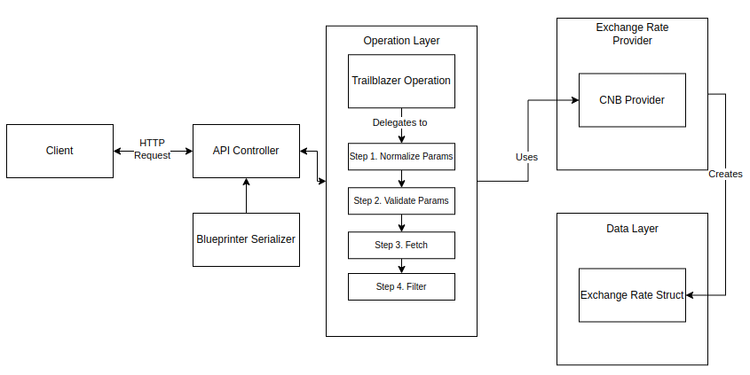

# Exchange Rate Provider

## 1. Description

The Exchange Rate Provider is an application that delivers current exchange rates from the Czech National Bank (CNB). It exposes a RESTful API that allows clients to retrieve exchange rates between currencies, with options for filtering by specific currencies, dates.

1. Documentation: https://exchange-rate-provider-u6pr.onrender.com/api-docs/index.html

## 2. Technologies Used

- **Ruby 3.4.2** - Core programming language
- **Rails 8.0.2** - Web application framework
- **Trailblazer** - Business logic architecture
- **Dry-Struct/Validation** - Type-safe data objects and validation
- **Blueprinter** - Fast, declarative JSON serialization
- **Swagger/OpenAPI** - API documentation
- **RSpec** - Testing framework
- **VCR/WebMock** - HTTP request recording/stubbing for tests
- **Docker/Docker Compose** - Containerization
- **Faraday** - HTTP client
- **Oj** - Fast JSON parser/generator

## 3. Architecture Explanation

The application follows a layered architecture with clear separation of concerns:

### Core Layers

1. **API Layer (Controllers)**
   - Handles HTTP requests/responses
   - Routes to appropriate operations
   - Returns properly formatted JSON

2. **Operation Layer (Trailblazer)**
   - Orchestrates business logic through steps
   - Validates and normalizes input parameters
   - Handles errors and provides meaningful responses

3. **Service Layer**
   - Provider pattern for exchange rate sources
   - HTTP clients for external API communication

4. **Data Layer**
   - Strongly typed data objects using Dry::Struct
   - Consistent data interface regardless of source
   - Clear validation rules

## 4. Architecture Diagram



## 5. Running Locally With Docker

1. Clone the repository

```
git clone https://github.com/mmarusyk/exchange-rate-provider.git
cd exchange-rate-provider
```

2. Build and start the containers

```
docker-compose build
docker-compose up
```

3. Get rates using the url: http://localhost:3000/api/v1/exchange_rates?source_currency=CZK

## 6. Documentation

The API is documented using OpenAPI/Swagger. Once the application is running, you can access the interactive documentation at:  http://localhost:3000/api-docs


## 7. Development

1. Running Tests

```
docker-compose run app bundle exec rspec
```

2. Running Rubocop

```
docker-compose run app bundle exec rubocop
```

3. Test Coverage

```
open coverage/index.html
```

4. Generate Swagger Documentation

```
docker-compose run app bundle exec rails rswag:specs:swaggerize
```
